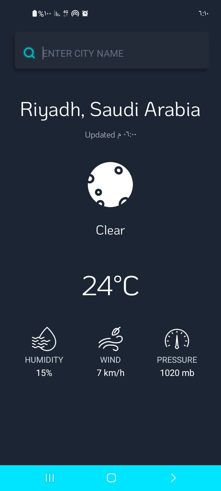

# Weather App – Android Kotlin

A modern Android weather application built with **Kotlin**, using **WeatherAPI.com** to fetch real-time weather conditions.The app automatically retrieves the user’s **current GPS location** on launch, and also supports searching for any city worldwide.Designed with a neon-styled dark UI and custom weather icons.

## Screenshots
--------------

## Features
----------

*   Auto-detect weather using **GPS location**
    
*   Search weather by **entering a city name**
    
*   Press **Enter** on keyboard to trigger search directly
    
*   Displays:
    
    *   Temperature
        
    *   Min & Max temperature
        
    *   Wind speed
        
    *   Pressure
        
    *   Humidity
        
    *   Weather condition text
        
    *   Last updated time
        
*   Neon-styled dark UI with custom weather icons
    
*   Fast and smooth API requests using **OkHttp + Coroutines**
    
*   Works on Android 7.0+ (API 24+)

    

## Technology Stack
--------------------

*   **Kotlin**
    
*   **WeatherAPI.com**
    
*   **OkHttp**
    
*   **Coroutines**
    
*   **FusedLocationProviderClient**
    
*   **ViewBinding**
    
*   **Material Components**
    
*   **Custom XML Layouts**
